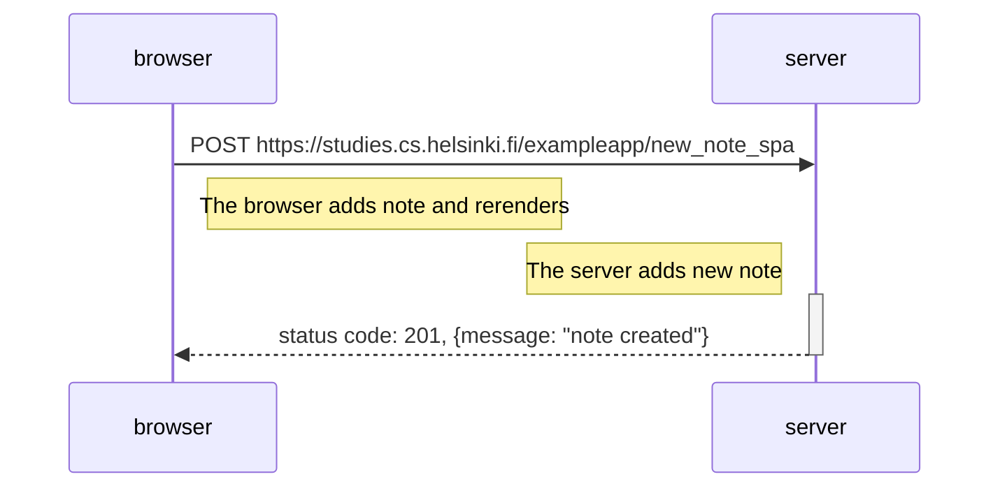

```mermaid
sequenceDiagram
    participant browser
    participant server
    
    browser->>server: POST https://studies.cs.helsinki.fi/exampleapp/new_note_spa
    Note right of browser: The browser adds note and rerenders

    Note left of server: The server adds new note
    activate server
    server-->>browser: status code: 201, {message: "note created"}
    deactivate server
    
```